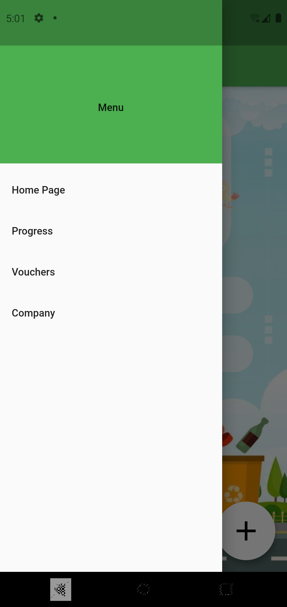

# Carbon-Less

Carbon-Less is a nice mobile app which integrates an AI (tflite file) and show you what product you want to recycle and what is its carbon footprint. The project was done in one day and night at a hackathon and because of that the backend is simulated.

### What it does ?
The idea is the following: Companies can save money if they convince their customers to recycle their products (avoids the taxes and also the raw material is cheaper if it comes back to them).

So here's a prototype app where a user can confirm that he has recycled a company's product and as a reward he can receive vouchers from the respective company.

### Screens :

- Base Screen : Contain Navigation Bar , Background Image and Floating Button. It is contained by all other screens. Here you can see the code that take a picture and recognize what product is in it

- Company Screen : This page is not made for users but for companies. Here they should be able to see how many tons have been recycled through the application.

- Main Screen : Here the user can see a sumar of its progress and his username.

 
 
 -Progress Screen :  Here the user can see his progress.
 
 
 
 -Vouchers Screen : Here the user can see his vouchers.
 
 
 
 -Nav Bar : how the nav bar looks like
 
 

